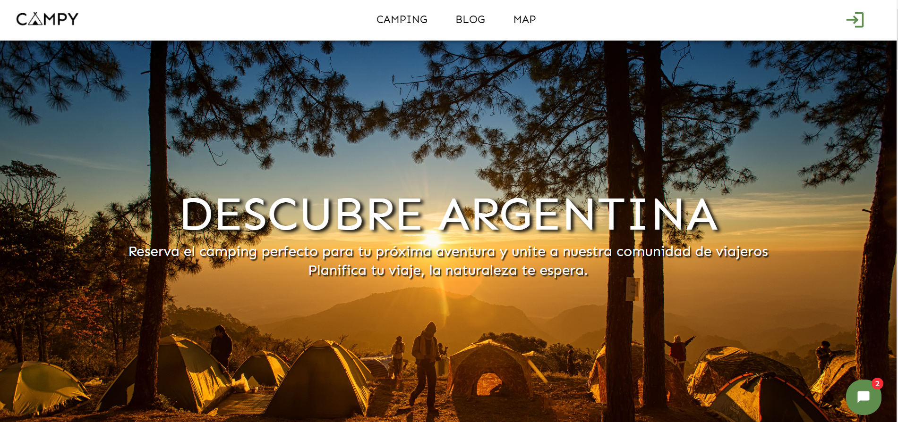
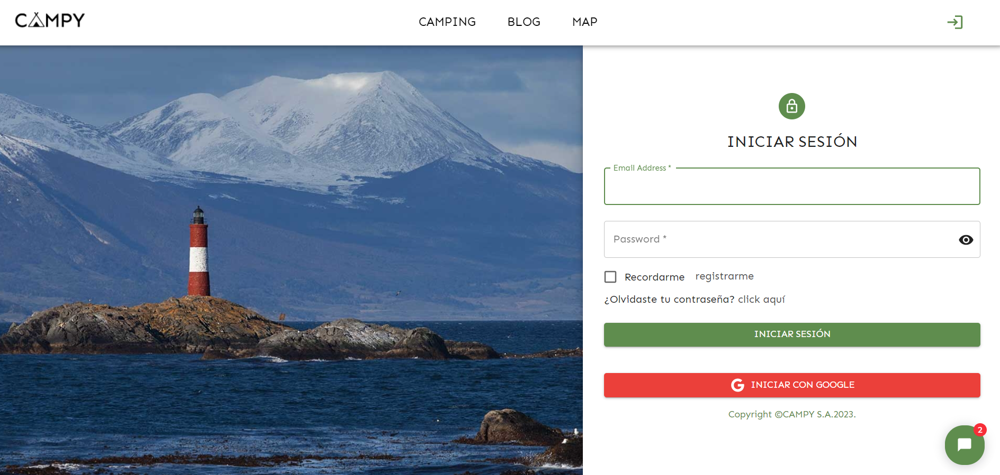
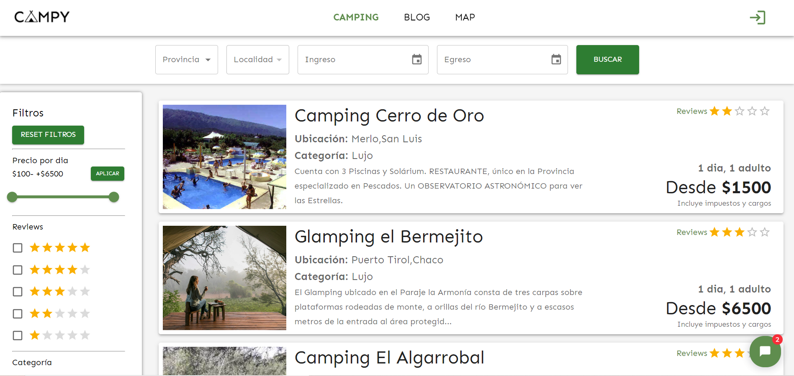

   

  

- 🌱 I’m currently learning **NextJS.**

- 👨‍💻 All of my projects are available at [https://github.com/ACRUNO?tab=repositories](https://github.com/ACRUNO?tab=repositories)

- 📫 How to reach me **jotadelgado96@gmail.com**

<h3 align="left">Connect with me:</h3>

<h3 align="left">Languages and Tools:</h3>

               

## Github Stats  

&nbsp;

 

## Projects

### Campy

~~~
📌 Final group project of Bootcamp Henry.

A booking app for campings in Argentina 

Design and develop a web page about campings including:
✔ Complex filters
✔ Map
✔ Authentication
✔ Bot
✔ Blog
✔ Different dashboards

Tech Utils:
🔹 Typescript
🔹 Front: React JS, Redux, Material-UI
🔹 Back: NodeJs, Express, Sequelize
🔹 Database: MySQL
~~~
👉Deploy: https://campy-frontend.vercel.app/

<h2>
Home --- Login
</h2>

<h2>
Booking --- Map
</h2>

  

<h2>
Blog --- Dashboard
</h2>

<h2>
Responsive Design
</h2>

___________________________________________
